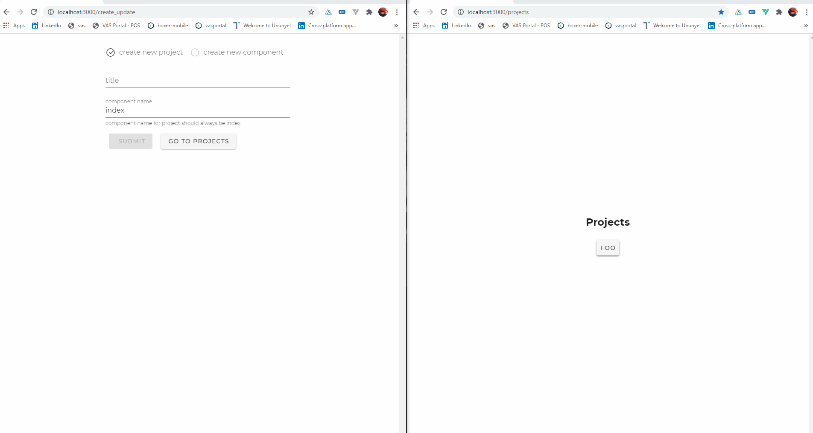

# DEVnIT

    Documentation solution for frontend developers. A snippet from my full project
    
## DEMO


## Motivation

   While I was working on my documentation site in 2019 I realised that documenting components are very time consuming and not all of my collegues would be able to
   document their own work unless they have to physically go into the code and make some changes.
   
   I came to the conclusion that the best method to approach this issue was to create a solution that enables the user to generate markdown files within a UI.
   my first attempt was with vuepress, although pretty powerful. it lacked alot of features I needed eg. a dynamic sidebar, I did however manage to create my own using node
   but it had some bugs so I was stuck abit and had to work on some other projects.
   
   When I saw nuxt came out with an awesome update called nuxt@content, I was very existed since I'm already using nuxt in my day to day job and this new feature has alot of        potenial so I set on a mission to create a solution for my previous issue.
   
## Features
    •	Node Js server
    •	socket IO connected to app.
    •	Ability to create .md files with a UI.
    

## Installation

   To get started simply clone repo and do an npm install


## Build Setup

```bash
# install dependencies
$ npm install

# serve with hot reload at localhost:3000
$ npm run dev

# build for production and launch server
$ npm run build
$ npm run start

# generate static project
$ npm run generate
```

For detailed explanation on how things work, check out [Nuxt.js docs](https://nuxtjs.org).
